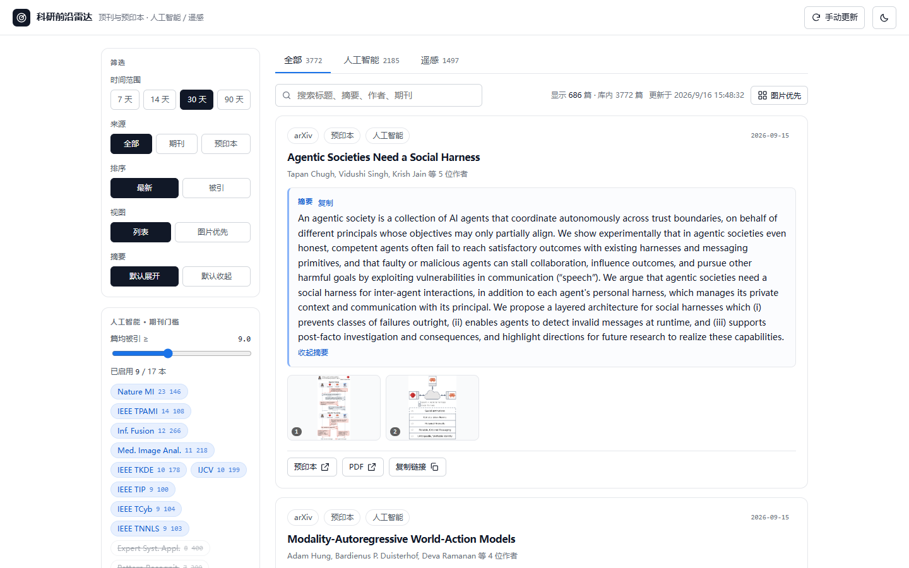
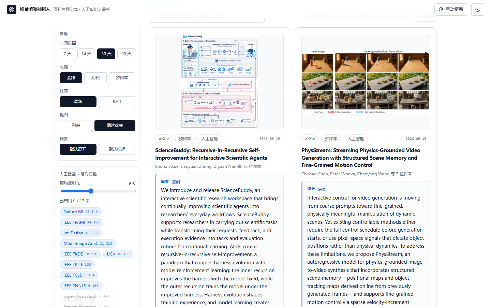
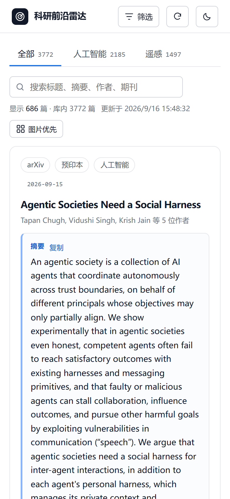

# 科研前沿雷达 · Research Frontier Radar

**一个链接，看全人工智能与遥感领域的顶刊新论文。**

自动汇总最新文献，把**摘要**和**正文配图**放在最显眼的位置——不必逐本翻期刊，也不必点开原文才知道值不值得读。

### 👉 <https://khc2297980652-art.github.io/research-frontier-radar/>

手机、平板、电脑打开即用，无需注册、无需安装。



<p align="center">
  
  
</p>

---

## 30 秒上手

1. **选学科** — 顶部「人工智能 / 遥感」标签页，数字是该学科当前的文献量。
2. **调门槛** — 左侧滑杆按**篇均被引**实时筛选期刊，默认只保留高影响力刊物（人工智能 ≥ 9、遥感 ≥ 6）；下方是该门槛下启用的期刊清单，点标签可只看某一本刊。
3. **看摘要和配图** — 卡片上摘要默认展开、独立高亮；配图以缩略图条呈现，点开是全屏大图（`Esc` 关闭，`←` `→` 切换）。搜索框支持标题、摘要、作者、期刊名。
4. **看全文** — 卡片底部给出 **DOI / 预印本 / PDF** 链接，点开用**你自己的机构权限**阅读。

其余：时间窗口 7 / 14 / 30 / 90 天可切；排序可选「最新」或「被引」；「图片优先」视图只在大图上快速扫读；深色模式跟随系统，也可手动切换。

---

## 收录范围

| 学科 | 期刊 | 默认门槛 | 预印本来源 |
| --- | --- | --- | --- |
| **人工智能** | 17 本：Nature MI、IEEE TPAMI、IJCV、IEEE TIP、Inf. Fusion、Med. Image Anal.、IEEE TKDE、IEEE TNNLS 等 | 篇均被引 ≥ 9（默认启用 9 本） | arXiv `cs.AI` `cs.LG` `cs.CV` `cs.CL` `cs.NE` `cs.RO` `stat.ML` |
| **遥感** | 19 本：RSE、ISPRS J P&RS、IEEE TGRS、ESSD、J. Remote Sens.、IEEE GRSM、ISPRS IJGI 等 | 篇均被引 ≥ 6（默认启用 18 本） | arXiv `eess.IV` `physics.ao-ph` + 关键词检索 |

时间窗口 90 天，每 6 小时自动更新一次。以 2026-09-16 的库为例：共 3772 篇（期刊 3376 / 预印本 396），其中 **2063 篇带摘要、225 篇带配图**。

---

## 关于数据，你该知道的几件事

**「篇均被引」不是影响因子。** JCR 影响因子是付费数据，本站改用 [OpenAlex](https://openalex.org) 的*两年篇均被引*作为免费替代口径。两者高度相关但数值有出入，所以界面上如实标注为「篇均被引」，滑杆调的也是它。

**约一半论文能看到摘要，瓶颈在出版商。** 摘要合并了 OpenAlex、[Crossref](https://www.crossref.org)、[Semantic Scholar](https://www.semanticscholar.org) 三个公开数据源，仍有一半左右拿不到——Elsevier 系的 Information Fusion、Pattern Recognition、Knowledge-Based Systems、Expert Systems with Applications 几乎不提供摘要。拿不到时卡片会写明「该来源未提供摘要」并给出原文链接，不会留白。

**配图只来自开放获取预印本。** 订阅制期刊的正文插图受版权保护，本站不抓取、不转载，只给 DOI 跳转。

**本站不做任何需要登录的抓取。** 付费期刊只索引元数据与摘要，全文由你用自己的机构订阅查看——所以这个链接可以放心转给同事。

---

## 常见问题

**某本期刊最近怎么没有新论文？**
部分出版方（尤其 IEEE）向开放索引供货会阶段性延迟。本站用 OpenAlex + Crossref 两条通道合并发现，仍可能遇到某本刊在窗口内确实没有新内容。侧边栏会用**虚线标签**标出这类期刊，鼠标悬停可看到它最新被索引的日期。

**为什么这篇没有摘要 / 没有配图？**
见上一节。摘要缺失是出版商的数据政策所致，配图则只有 arXiv 预印本提供。

**打开有点慢？**
首次需加载约 1.7 MB（gzip 后）的数据，之后浏览器缓存，10 分钟内不重复传输。站点托管在 GitHub Pages，国内访问时快时慢。

**顶部的「手动更新」是做什么的？**
数据每 6 小时由定时任务重建一次；点它会打开 GitHub Actions 页面，可手动触发一次重新抓取（约 5 分钟）。

**能加上我关心的期刊或学科吗？**
可以，见文末「自行部署」；也欢迎直接开 Issue 告诉我。

---

## 后续开发方向

**近期**

- **配图覆盖面** — 把开放获取期刊（Nature Communications、MDPI、Frontiers 等的 CC-BY 图片）也纳入配图源，不再只限 arXiv 预印本。
- **摘要覆盖率** — 接入 Europe PMC / PubMed 等开放源，继续压缩「无摘要」的比例。
- **订阅推送** — 按学科或关键词提供 RSS / 邮件摘要。
- **收藏与已读** — 浏览器本地保存，不需要账号。

**中期**

- **新增学科** — 生命科学、材料、地球科学等，加一段配置即可，无需改代码。
- **AI 速读** — 为每篇论文生成一句话中文速览与要点，支持中英摘要切换。
- **指标扩展** — 补充 h-index、SJR 等免费口径，支持更细的期刊筛选。
- **PWA** — 加到手机主屏，支持离线阅读。

**探索**

- **国内访问优化** — 镜像站或香港 / 新加坡轻量服务器（免备案），给国内同行更稳的体验。
- **个性化推荐** — 按阅读偏好排序。
- **文献管理联动** — 一键导入 Zotero。

---

## 自行部署（可选）

想换成本方向的期刊清单、加学科，或者自己维护一份：

```bash
git clone https://github.com/khc2297980652-art/research-frontier-radar.git
cd research-frontier-radar
npm ci
npm run build:static    # 抓取 + 打包成纯静态站点
npm start               # 或本地起服务：http://localhost:8787
```

- **学科与期刊白名单**集中在根目录的 `journals.json`，改这一个文件即可，前端会自动出现新学科标签页（文件内有字段说明）。
- **自动发布**：仓库已含 GitHub Actions 工作流。推送到你自己的仓库后，到 **Settings → Pages** 把 Source 选为 **GitHub Actions**，之后每 6 小时自动重建发布——不需要服务器、不需要域名、不需要备案。
- **窗口与频率**：`journals.json` 里的 `windowDays`（默认 90 天）、`refreshIntervalHours`（默认 6 小时）。

---

## 反馈

想加期刊、加学科，或发现数据有问题，欢迎开 [Issue](https://github.com/khc2297980652-art/research-frontier-radar/issues)。

数据来自 [OpenAlex](https://openalex.org)、[Crossref](https://www.crossref.org)、[Semantic Scholar](https://www.semanticscholar.org) 与 [arXiv](https://arxiv.org)。本站只做索引与聚合，论文与图片的版权归原作者及出版方所有。
